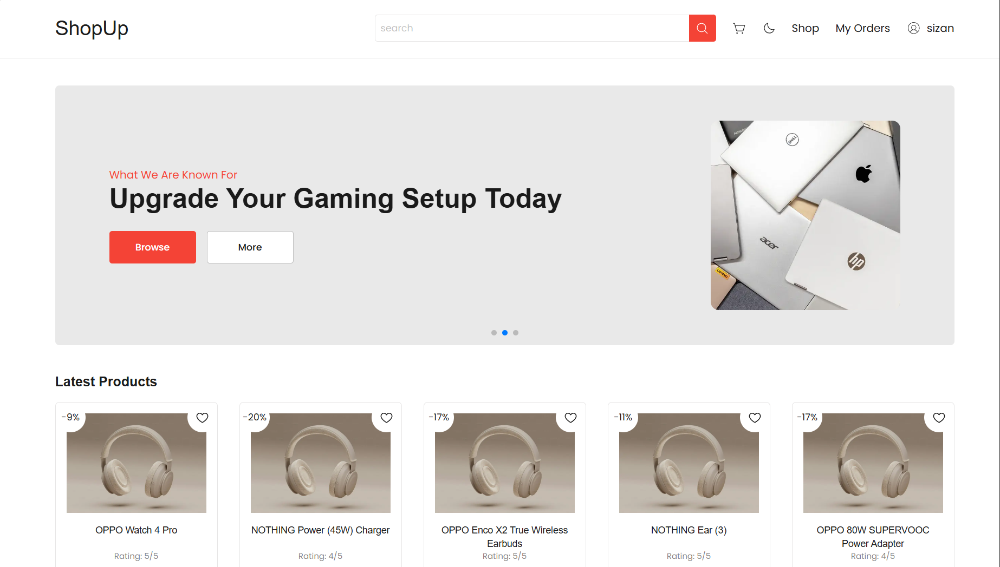
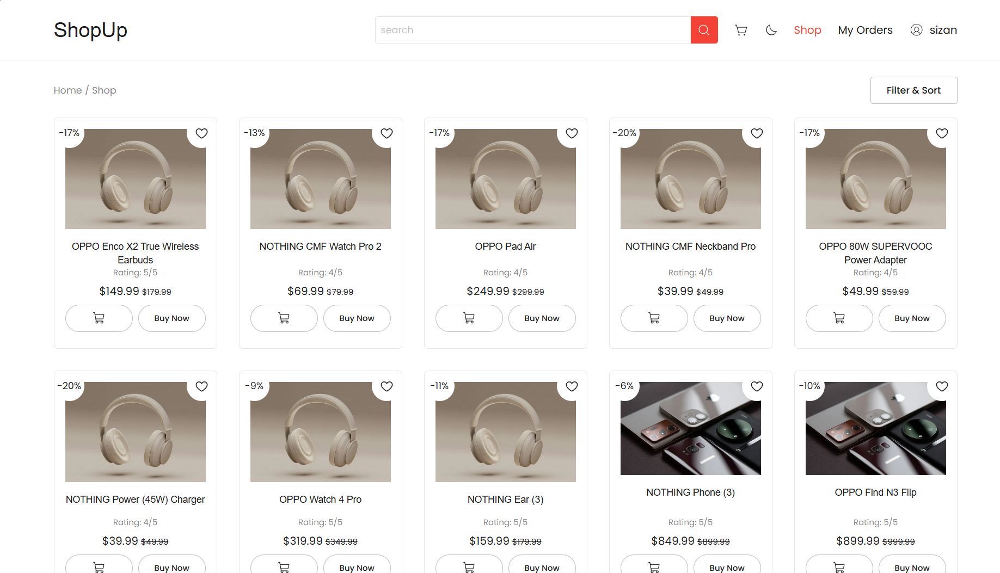
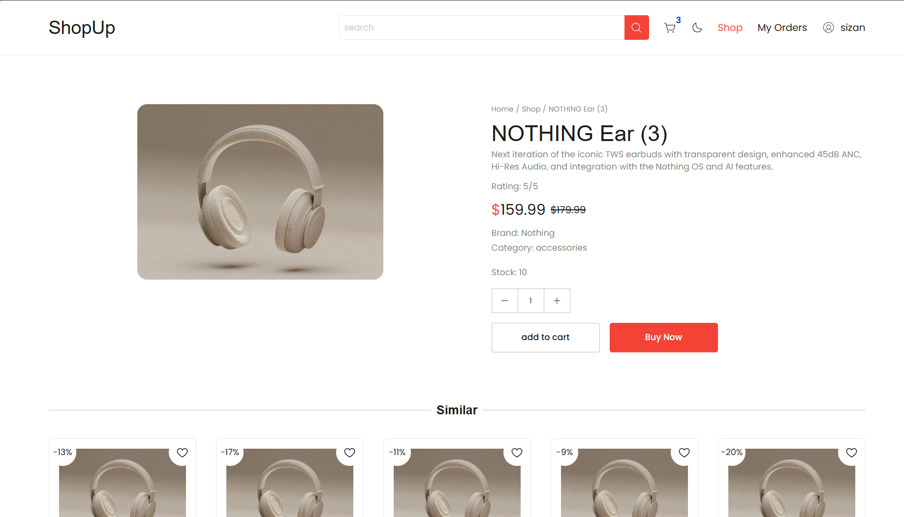
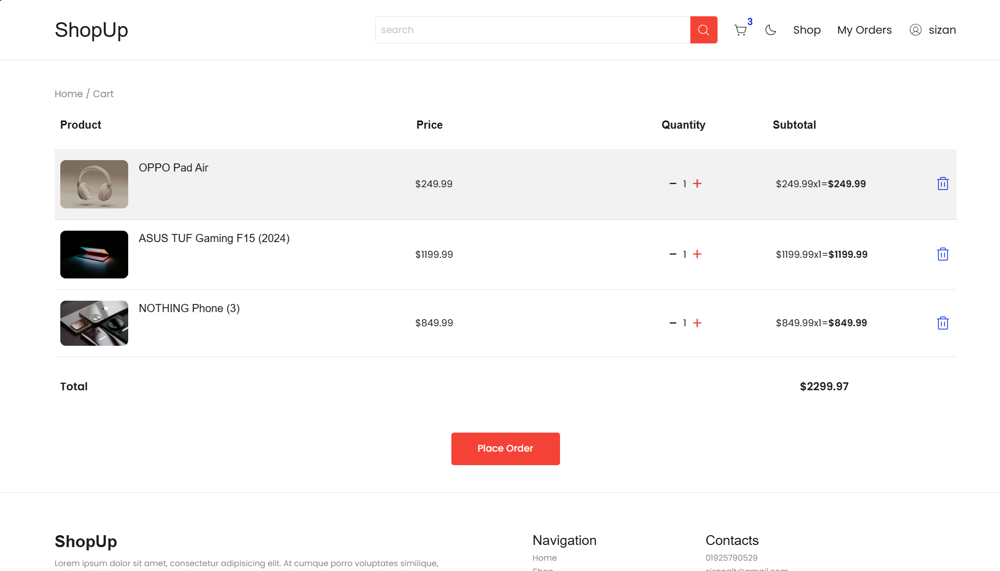
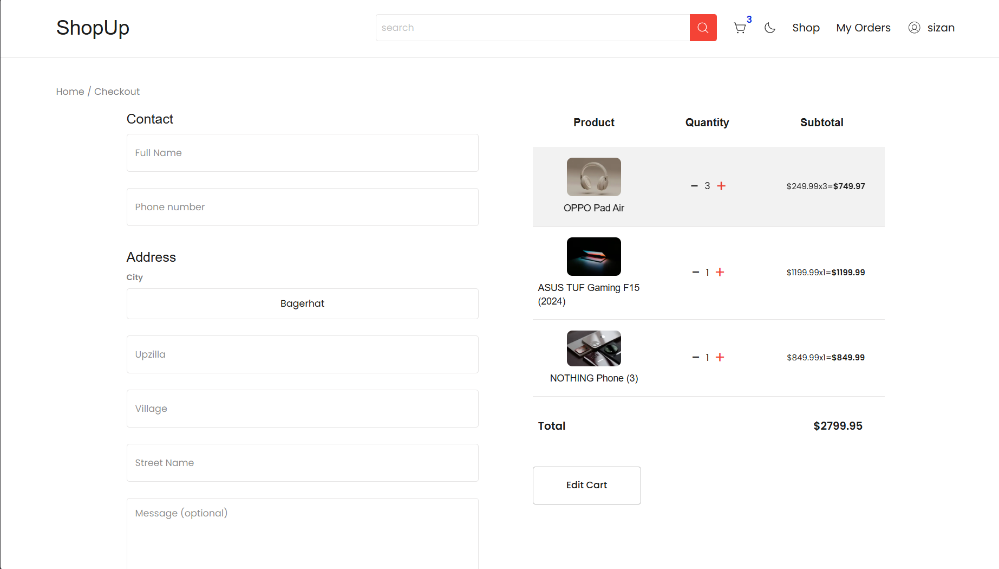
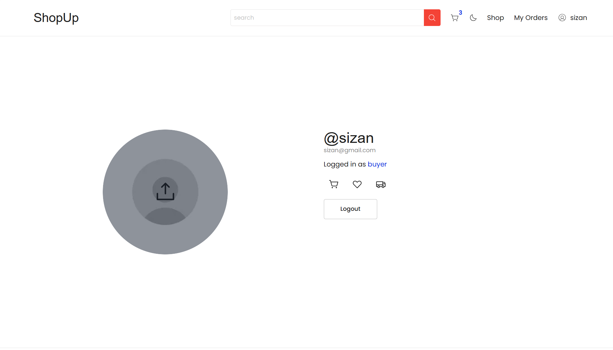

# ShopUp 🚀



**ShopUp** is a production-ready full-stack e-commerce platform built with **Next.js**, **Express.js**, **PostgreSQL**, and **TypeScript**. It features custom session-based authentication, raw SQL, responsive design, and an integrated seller dashboard for product management.

---

## 🌐 Live Demo

- **Store:** [https://shopup-sizan.vercel.app](https://shopup-sizan.vercel.app)

> Note: Deployed on free-tier services. Initial load may take a few seconds.

---

## Highlights

- 🔐 Custom session-based authentication with bcrypt and UUID sessions
- ⚡ 40+ RESTful API endpoints
- 🗄️ PostgreSQL with raw SQL (no ORM)
- 📱 Fully responsive buyer and seller interfaces
- ☁️ Product image storage using Supabase Storage

---

## ✨ Features

### 🛍️ Customer Storefront

- Mobile‑first, fully responsive UI
- Product catalog with ratings & pricing
- Shopping cart & wishlist
- Search and filtering
- Secure user authentication (Login / Signup)

### 🧑‍💼 Admin Dashboard

- Product upload & management
- Inventory tracking (upcoming)
- Order management (upcoming)

### ⚡ Technical Highlights

- Next.js App Router & Server Components
- Tailwind CSS for fast, scalable styling
- Zustand for lightweight state management
- **Raw SQL** for full control over database schema design and query execution.

---

## 📸 Preview

#### Shop



#### Product Details



#### Cart



#### Checkout



#### User



---

## 🏗 Architecture

```text
                    Browser
                       │
                       ▼
      Next.js + React + TypeScript
      Tailwind CSS • Zustand
                       │
                 REST API (HTTP)
                       │
                       ▼
        Express.js • Zod • bcrypt
                       │
          UUID Session Authentication
                       │
        ┌──────────────┴──────────────┐
        ▼                             ▼
 PostgreSQL (Supabase)        Supabase Storage
   Raw SQL (No ORM)            Product Images
```

---

## 🛠 Tech Stack

**Frontend**

- Next.js
- React
- TypeScript
- Tailwind CSS
- Zustand

**Backend**

- Express.js
- REST API
- Zod
- bcrypt

**Database & Storage**

- PostgreSQL (Supabase)
- Supabase Storage
- Raw SQL (No ORM)

**Deployment**

- Vercel (Next.js apps)
- Backend deployed to Render

---

## 📁 Project Structure (Monorepo)

```
shopup/
├── frontend/                     # Next.js frontend application
│   ├── app/
│   │   ├── (buyer)/              # Buyer-facing routes (store, cart, profile)
│   │   └── (seller)/             # Seller/Admin routes (dashboard, products, orders)
│   ├── assets/
│   ├── ui/                       # Reusable Tailwind UI components
│   ├── lib/                      # Utilities, helpers, API clients
│   ├── public/
│   ├── types/
│   ├── context/
│   ├── .env
│   ├── middleware.ts             # Next.js middleware
│   └── package.json
├── backend/                      # Express.js backend API
│   ├── routes/                   # API route definitions
│   ├── controllers/              # Request handlers / business logic
│   ├── schema/                   # Zod validation schemas
│   ├── middlewares/
│   ├── utils/
│   ├── .env
│   ├── app.js
│   ├── server.js
│   └── package.json
└── README.md                     # Project documentation

```

---

## 🚀 Quick Start

### Prerequisites

- Node.js **20+**
- Supabase account (PostgreSQL)

### 1️⃣ Clone & Install

```bash
git clone https://github.com/sizan14789/shopup.git
cd shopup/frontend; npm i; cd ../backend; npm i
```

### 2️⃣ Environment Setup

Create `.env.local` in `frontend/`:

```env
BACKEND_URL='http://localhost:4000'
NEXT_PUBLIC_BACKEND_URL='http://localhost:4000'
```

Create `.env.local` in `backend/`:

```env
PORT=4000
ENV='dev'
FRONTEND_URL='http://localhost:3000'

SUPABASE_URL=<supabase server url> #'https://<url>.supabase.co'
SUPABASE_KEY=<service key>         #Don't use anon key

# PG_HOST=<database host name>
# PG_DATABASE=<database name>      #'postgres' usually
# PG_PORT=<database PORT>          #5432 usually
# PG_USER=<username>               #'postgres' usually
# PG_PASSWORD=<postgres password>
```

### 3️⃣ Development (Run from shopup folder)

```bash
# frontend
npm run frontend

# Backend API
npm run backend
```

## 🗄 Database Schema

The application uses a relational PostgreSQL database designed with normalized tables.

```text
Users
├── Sessions
├── Cart
├── Wishlist
└── Orders
      │
      └──────────────┐
                     │
Products ────────────┘
```

**Core Tables**

- Users
- Sessions
- Products
- Cart
- Wishlist
- Orders

---

## 🎨 Design System

- **Typography:** Poppins (Google Fonts)
- **Colors:** CSS custom properties (`--bg`, `--text`, `--primary`)
- **Components:** Fully reusable Tailwind components in `frontend/ui/`

---

## 📱 Responsive Design

- Mobile‑first layout
- Tailwind responsive utilities
- Hamburger navigation & mobile menu
- Touch‑friendly interactions

---
